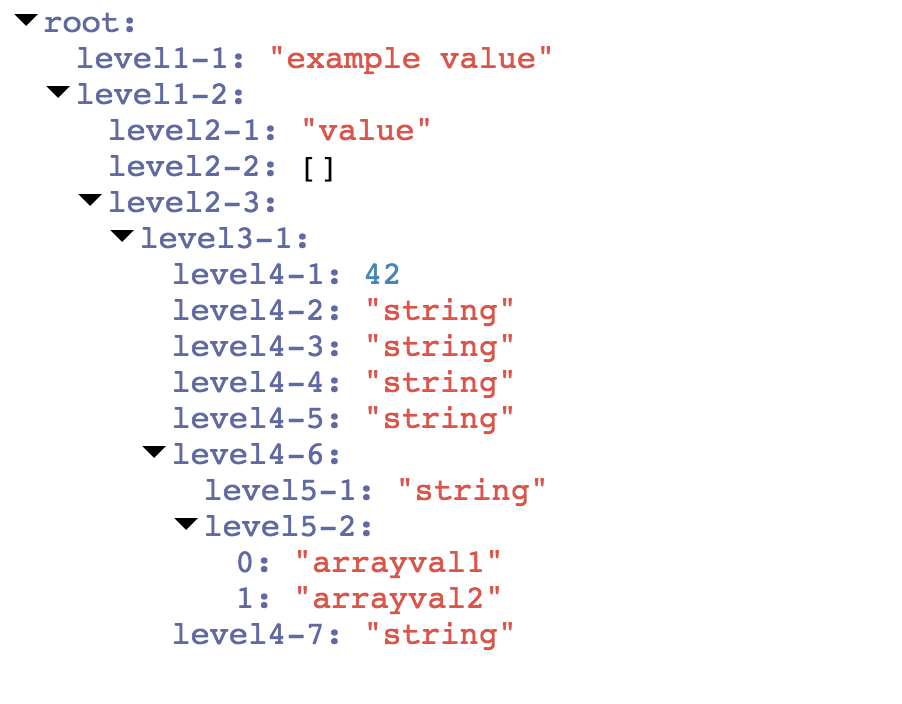

<ui-treeview> web component
---------------------------

Web component used to display JSON & JavaScript object data in a collapsible tree view.



## Author

Originally created by [jsoverson](https://github.com/jsoverson), [here](https://github.com/jsoverson/ui-treeview)

Upgraded to Polymer 3.0 by Protryon

## Usage

[Demo](http://jsoverson.github.io/ui-treeview)

```html
<ui-treeview>
{
    "root": {
        "level1-1": "example value",
        "level1-2": {
            "level2-1": "value",
            "level2-2": [],
            "level2-3": {
                "level3-1": {
                    "level4-1": 42,
                    "level4-2": "string",
                    "level4-3": "string",
                    "level4-4": "string",
                    "level4-5": "string",
                    "level4-6": {
                        "level5-1": "string",
                        "level5-2": ["arrayval1", "arrayval2"]
                    },
                    "level4-7": "string"
                }
            }
        }
    }
}
</ui-treeview>
```

## Attributes

### expanded

Type: boolean

Use to fully expand the tree by default

```html
<ui-treeview expanded></ui-treeview>
```

## Methods

### display(data : Object)

Use to pass data a JavaScript object to display.

```javascript
var element = document.getElementById('myTreeId');
var object = { foo : "bar", baz : 4 };
element.display(object);
```

## License

MIT
